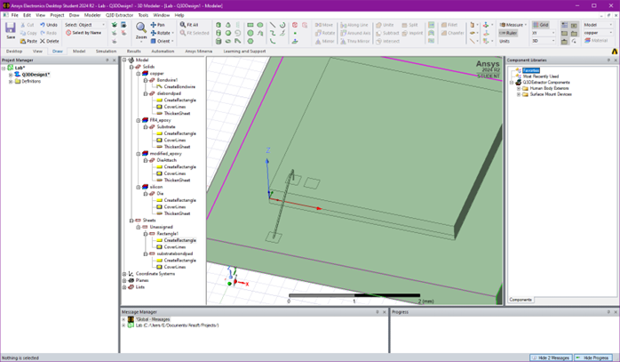
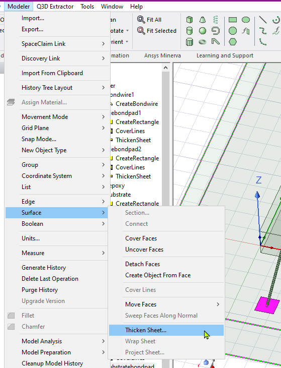

## Lab 2 (Module 5) Design a wire bond package (die, die attach, wire bonding, molding)

The model will be built in Q3D 

Adding the die based on the specifications:
3mmx3mm, thickness 0.2mm
A corner of the die in (0,0,0)

“Draw” tab:

Select a rectangle:

Draw it:

Modify properties:

Add the thickness:
Select the rectangle, then
Modeler > Surface > Thicken Sheet

Rename “Rectangle” to “Die”:
Click on Rectangle, modify name
Also, set material to Si

Add substrate:
Select “Rectangle”, draw it:

Click on Rectangle1/CreateRectangle, adjust the size based on the spec (5mm x 5mm), adjust the position such as the die is on the center:

Thickness of the substrate: 500u:
Select Substrate rectangle / Modeler>Surface>Thicken Sheet:

=> thickness must be –5mm
Click on 3Thicken Sheet”:

Adjust thickness to -5mm:

Let’s adjust the substrate properties: Name, material
Click on Rectangle1:

But the die is not directly sitting on the substrate, there is also the die attach material, we need to adjust the Z position:

Click on Substrate/CreateRectangle:

Adding the die attach material:
Create a rectangle with the same size as the die:

And add the thickness as -0.1mm:

Adjust properties: name, material:

Wire Bonding:

Draw bond pads, on the die and the on the substrate:
Create a rectangle, edit properties:

Add thickness of 5um:

Create bond pad on the substrate:
Draw rectangle, adjust properties:

And rename bond pads:

Connect the Bond pads with Bond Wire:

We’ll choose the defaults parameters.

Create a second die bonding pad:

And rename to diebondpad2:

Create a second substrate bond pad, add thickness:

Select “Gold” for the bond wires material:

The mold compound will come over all the substrate, thickness > die attach (0.1mm) + die (0.2mm) + wire bond height (about 0.4mm)
To create mold, first create a rectangle over the substrate:

Add thickness:

, name and material:

Enough mold compound height for laser marking, so wire bonds will not be affected

